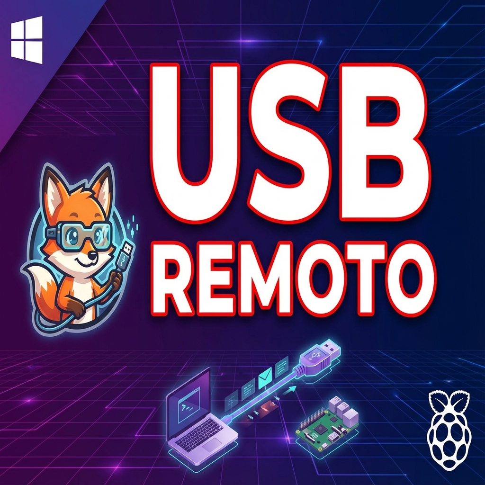

# 🦊 SnakeUSBIP - Cliente USB/IP Gratuito para Windows

**v1.6.1** | [Descargar Última Versión](https://github.com/Snakefoxu/SnakeUSBIP/releases/latest)

**Comparte y conecta dispositivos USB por red (LAN/WiFi) fácilmente.**
Transforma tu Raspberry Pi o servidor Linux en un Hub USB Virtual accesible desde Windows 10 y 11. Olvida la línea de comandos; usa nuestra **GUI moderna** para conectar impresoras, escáneres y dongles remotamente.

[](https://github.com/SnakeFoxu/SnakeUSBIP/releases)
[](https://github.com/SnakeFoxu/SnakeUSBIP/stargazers)
[](LICENSE)
[](https://github.com/SnakeFoxu/SnakeUSBIP)

## 🎬 Video Tutorial

<a href="https://www.youtube.com/watch?v=mETEs9INlq4">
  
</a>

▶️ **[Ver tutorial completo en YouTube](https://www.youtube.com/watch?v=mETEs9INlq4)**

## ✨ Características

- 🔍 **Autodescubrimiento** - Escanea servidores USB/IP en tu red local
- 🔌 **Conexión fácil** - Conecta/desconecta dispositivos con un click
- ⭐ **Favoritos** - Guarda dispositivos para reconexión rápida
- � **Log de Actividad** - Historial de conexiones, escaneos y errores
- 🖥️ **SSH integrado** - Configura servidores Raspberry Pi directamente
- 📋 **Info detallada** - VID:PID y fabricante de cada dispositivo
- 🎨 **GUI moderna** - Interfaz estilo macOS con botones redondos
- 🌐 **Multi-idioma** - Español e Inglés
- 🔄 **Auto-actualización** - Detecta nuevas versiones desde GitHub

## 📦 Instalación

### Opción 1: Portable (Recomendado)
1. Descarga `SnakeUSBIP-Portable.zip` desde [Releases](https://github.com/Snakefoxu/SnakeUSBIP/releases/latest)
2. Extrae el ZIP en cualquier carpeta
3. Ejecuta `SnakeUSBIP.exe` como Administrador
4. ¡Listo!

### Opción 2: Instalador
1. Descarga `SnakeUSBIP-Setup.exe` desde [Releases](https://github.com/Snakefoxu/SnakeUSBIP/releases/latest)
2. Ejecuta el instalador como Administrador
3. Sigue el asistente de instalación

### Opción 3: Desde código fuente
```powershell
# Requiere PS2EXE (https://github.com/MScholtes/PS2EXE)
Invoke-PS2EXE -InputFile "SnakeUSBIP.ps1" -OutputFile "SnakeUSBIP.exe" -NoConsole -requireAdmin -iconFile "Logo-SnakeFoxU-con-e.ico"
```

## 🚀 Uso Rápido

1. **Escanear** - Click en `🔍 Escanear` para encontrar servidores
2. **Listar** - Click en `🔄 Listar` para ver dispositivos disponibles
3. **Conectar** - Doble-click en un dispositivo o click derecho → Conectar
4. **Desconectar** - Click derecho → Desconectar

## 🍓 Servidor en Raspberry Pi

Ver [docs/RASPBERRY_PI_SERVER.md](docs/RASPBERRY_PI_SERVER.md) para instrucciones completas.

**Resumen rápido:**
```bash
sudo apt update && sudo apt install -y linux-tools-generic
sudo modprobe usbip_host
sudo usbipd -D
sudo usbip list -l
sudo usbip bind -b 1-1.4  # Reemplaza con tu bus-id
```

## 🚀 Próximas Actualizaciones

**v1.7-1.8:**
- 🔄 Auto-Reconnect | 📊 Logs Mejorados | 🌙 Modo Oscuro | 🔔 Notificaciones

**v2.0:**
- 🗜️ Compresión de Datos | 📈 Dashboard de Rendimiento | 🏷️ Nicknames | 🔒 Filtros IP

**v2.x:**
- 🌍 Conexión Internet (NAT traversal) | 🖥️ Servidor Windows | 🐧 Cliente Multiplataforma (Linux/Mac) | 🤖 Detección Auto

## 📁 Estructura

```
Portable/
├── SnakeUSBIP.exe      # Aplicación principal
├── SnakeUSBIP.ps1      # Código fuente PowerShell
├── usbipw.exe          # Cliente USB/IP
├── devnode.exe         # Gestor de dispositivos
├── libusbip.dll        # Librería USB/IP
├── drivers/            # Drivers USB/IP
├── usb.ids             # Base de datos USB
├── CleanDrivers.ps1    # Script para limpiar drivers
└── Logo-SnakeFoxU-con-e.ico  # Icono de la app
```

## ⚙️ Requisitos

- Windows 10/11
- Permisos de Administrador
- Red local con servidor USB/IP

## 📄 Licencia

MIT License - Ver [LICENSE](LICENSE)

## 🙏 Créditos

- **USB/IP**: Proyecto original de Linux
- **SnakeUSBIP**: GUI por SnakeFoxu 2025
