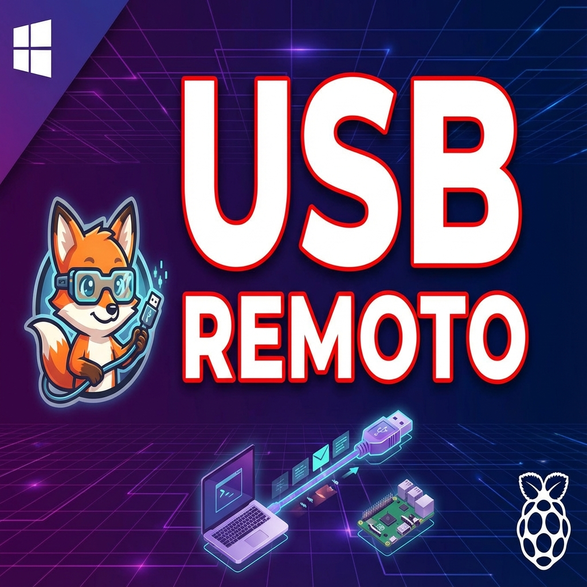

# 🦊 SnakeUSBIP - Cliente USB/IP Gratuito para Windows

🌐 **Idioma / Language:** [English](README.md) | **Español**

**v2.0.2** | [Descargar Última Versión](https://github.com/Snakefoxu/SnakeUSBIP/releases/latest) | [📖 Manual de Usuario](docs/USAGE_ES.md) | [🌐 Conexión VPN](docs/VPN_INTERNET_ES.md)

**Comparte y conecta dispositivos USB por red (LAN/WiFi/Internet) fácilmente.**
Transforma cualquier dispositivo Linux en un Hub USB Virtual accesible desde Windows 10 y 11. Compatible con **Raspberry Pi, Orange Pi, Banana Pi, routers OpenWRT, CrealityBox** y cualquier placa ARM/x86 con Linux.

[](https://github.com/SnakeFoxu/SnakeUSBIP/releases)
[](https://github.com/SnakeFoxu/SnakeUSBIP/stargazers)
[](LICENSE)
[-lightgrey?style=flat-square&logo=windows)](https://github.com/SnakeFoxu/SnakeUSBIP)

## 🎬 Video Tutorial

<a href="https://www.youtube.com/watch?v=mETEs9INlq4">
  
</a>

▶️ **[Ver tutorial completo en YouTube](https://www.youtube.com/watch?v=mETEs9INlq4)**

## 🆕 Novedades en v2.0.2

- 🏗️ **Reescritura Completa** - Migrado de PowerShell a .NET 9 (C# / WPF)
- 🔔 **Notificaciones Híbridas** - Popups no intrusivos (Ventana) + BalloonTips (Bandeja)
- 💾 **Persistencia de Dispositivos** - Recuerda dispositivos conectados tras reiniciar
- ⚡ **Ultra-Rápido** - Interfaz nativa con tiempos de respuesta instantáneos
- ✏️ **Renombrar Dispositivos** - Asigna nombres personalizados a dispositivos USB (guardados permanentemente)
- 📚 **Base de Datos Actualizada** - `usb.ids` de Diciembre 2025 (+17,000 nuevos dispositivos)
- 🐛 **Correcciones** - Arreglado Auto-Update, conflictos de hardware y lógica del monitor

## ✨ Características

- 🔍 **Autodescubrimiento** - Escanea servidores USB/IP en tu red local
- 🌐 **Conexión por Internet** - Conecta vía Tailscale/ZeroTier (NAT traversal)
- 🔌 **Conexión fácil** - Conecta/desconecta dispositivos con un click
- ⭐ **Favoritos** - Guarda dispositivos para reconexión rápida
- 📋 **Log de Actividad** - Historial de conexiones, escaneos y errores
- 🖥️ **SSH integrado** - Configura servidores Raspberry Pi directamente
- 📋 **Info detallada** - VID:PID y fabricante de cada dispositivo
- 🎨 **GUI nativa WPF** - Interfaz con temas claro/oscuro
- 🌐 **Multi-idioma** - Español e Inglés
- 🔄 **Auto-actualización** - Detecta nuevas versiones desde GitHub

## 📦 Instalación

### Opción 1: Portable 
1. Descarga desde [Releases](https://github.com/Snakefoxu/SnakeUSBIP/releases/latest):
   - **Windows x64**: `SnakeUSBIP-v2.0.0-x64.zip`
   - **Windows ARM64**: `SnakeUSBIP-v2.0.0-arm64.zip` (Surface Pro X, etc.)
2. Extrae el ZIP en cualquier carpeta
3. Ejecuta `SnakeUSBIP.exe` como Administrador
4. ¡Listo!

### Opción 2: Instalador (solo x64) (Recomendado)
1. Descarga `SnakeUSBIP_Setup_v2.0.0.exe` desde [Releases](https://github.com/Snakefoxu/SnakeUSBIP/releases/latest)
2. Ejecuta el instalador como Administrador
3. Sigue el asistente de instalación

### ⚠️ Usuarios ARM64
Los drivers ARM64 son **test-signed**. Ver `README_ARM64.md` en el ZIP para instrucciones sobre cómo habilitar Windows Test Mode.

## 🚀 Uso Rápido

1. **Escanear** - Click en `🔍 Escanear` para encontrar servidores
2. **Listar** - Click en `🔄 Listar` para ver dispositivos disponibles
3. **Conectar** - Doble-click en un dispositivo o click derecho → Conectar
4. **Desconectar** - Click derecho → Desconectar

### 🌐 Conexión por Internet (VPN)

1. Instala **[Tailscale](https://tailscale.com/download)** en Windows y en tu servidor
2. Click en `🌐 VPN` para ver peers con USB/IP activo
3. Selecciona un servidor remoto y conecta

Ver [docs/VPN_INTERNET_ES.md](docs/VPN_INTERNET_ES.md) para guía completa.

## 🐧 Servidor USB/IP (Linux)

Funciona en **cualquier dispositivo con Linux** que tenga puertos USB:

| Dispositivo | Compatibilidad |
|-------------|----------------|
| 🍓 Raspberry Pi (todos) | ✅ Recomendado |
| 🍊 Orange Pi / Banana Pi | ✅ |
| 📦 Arduino Yún / similar | ✅ |
| 📡 Routers con OpenWRT | ✅ |
| 🖨️ CrealityBox (OpenWRT) | ✅ |
| 💻 Cualquier PC Linux | ✅ |
| 🖥️ Servidor x86/ARM | ✅ |

Ver [docs/RASPBERRY_PI_SERVER_ES.md](docs/RASPBERRY_PI_SERVER_ES.md) para instrucciones completas.

## 🖥️ Servidor USB/IP (Windows) - ¡NUEVO!

**SnakeUSBIP Server** es una interfaz gráfica para [usbipd-win](https://github.com/dorssel/usbipd-win) que permite compartir dispositivos USB desde Windows de forma sencilla.

### Características
- 🔧 **Auto-instalación** del driver usbipd-win
- 📤 **Compartir/Detener** con un click
- 🔒 **Un solo UAC** al iniciar (sin popups durante el uso)
- 📛 **Nombres descriptivos** via enriquecimiento WMI
- 🗑️ **Desinstalación** para limpiar drivers

### Descarga
Descarga `SnakeUSBIP-Server-v2.2.zip` desde [Releases](https://github.com/Snakefoxu/SnakeUSBIP/releases/latest)

### Inicio Rápido
1. Extrae el ZIP
2. Ejecuta `SnakeUSBIP-Server.exe` como Administrador
3. Click en **Compartir** en cualquier dispositivo USB
4. Usa el cliente SnakeUSBIP para conectar desde otro PC

**Resumen rápido (Debian/Ubuntu/Raspbian):**
```bash
sudo apt update && sudo apt install -y linux-tools-generic hwdata
sudo modprobe usbip_host
sudo usbipd -D
sudo usbip list -l
sudo usbip bind -b 1-1.4  # Reemplaza con tu bus-id
```

**OpenWRT:**
```bash
opkg update && opkg install usbip-server kmod-usb-ohci
usbipd -D
```

## 🎯 ¿Qué puedo hacer con mi dispositivo?

¿Tienes una **Raspberry Pi, Orange Pi o CrealityBox** sin usar? ¡Conviértelos en un Hub USB remoto!

| Dispositivo | Caso de Uso |
|-------------|-------------|
| 🖨️ **CrealityBox** | Comparte la impresora 3D USB, por red. Conecta desde cualquier PC sin cables |
| 🍓 **Raspberry Pi** | Hub USB central: escáneres, dongles de licencia, lectores de tarjetas |
| 🍊 **Orange Pi** | Servidor USB compacto y económico para oficina |
| 📡 **Router OpenWRT** | Comparte USB de almacenamiento o impresora desde el router |
| 🔐 **Dongle de Licencia** | Comparte llaves USB de software (AutoCAD, etc.) entre PCs |

## 📁 Estructura

```
SnakeUSBIP/
├── SnakeUSBIP.exe      # Aplicación principal (.NET 9 WPF)
├── usbipw.exe          # Cliente USB/IP
├── devnode.exe         # Gestor de dispositivos
├── libusbip.dll        # Librería USB/IP
├── drivers/            # Drivers USB/IP (WHLK certified x64)
├── usb.ids             # Base de datos USB (Dic 2025)
├── CleanDrivers.ps1    # Script para limpiar drivers
└── Logo-SnakeFoxU-con-e.ico  # Icono de la app
```

## ⚙️ Requisitos

- Windows 10/11
- Permisos de Administrador
- Red local con servidor USB/IP

## 🗺️ Roadmap

Funcionalidades planificadas para futuras versiones:

| Funcionalidad | Descripción | Estado |
|---------------|-------------|--------|
| 🔄 **Reconexión Inteligente** | Reconexión automática con backoff exponencial ante caídas | Planificado |
| 📋 **Perfiles de Conexión** | Guardar configs completas (servidor + dispositivo + VPN) como perfiles | Planificado |
| 🔔 **Bandeja Mejorada** | Conectar/desconectar rápido desde la bandeja con indicadores de estado | Planificado |
| 🩺 **Diagnóstico de Red** | Test de conexión integrado (ping, latencia, verificación puerto TCP 3240) | Planificado |
| 📊 **Dashboard de Dispositivos** | Iconos por tipo, monitoreo de ancho de banda y latencia en tiempo real | Planificado |
| 🧙 **Asistente de Inicio** | Guía de primera ejecución: instalar drivers → escanear → conectar | Planificado |
| 🌐 **API Tailscale/ZeroTier** | Detectar automáticamente peers VPN con servidores USB/IP activos | Planificado |
| 🌍 **Más Idiomas** | Alemán, francés, portugués (¡contribuciones de la comunidad bienvenidas!) | Planificado |
| 📱 **App Android** | Monitorear conexiones USB/IP desde el móvil | En estudio |
| 🔌 **Plugin OctoPrint/Klipper** | Auto-configurar USB/IP en Raspberry Pi con descubrimiento mDNS | En estudio |

> 💡 **¿Tienes una idea?** Abre un [Issue](https://github.com/Snakefoxu/SnakeUSBIP/issues) o inicia una [Discusión](https://github.com/Snakefoxu/SnakeUSBIP/discussions)!

## 📄 Licencia

GPL v3 (GNU General Public License) - Ver [LICENSE](LICENSE)

## 🙏 Créditos

Este proyecto no sería posible sin el trabajo de:

| Proyecto | Autor | Contribución |
|----------|-------|--------------|
| [usbip-win2](https://github.com/vadimgrn/usbip-win2) | **Vadim Grn** | Drivers USB/IP firmados por Microsoft (WHLK certified). Core del cliente Windows. |
| [OctoWrt](https://github.com/ihrapsa/OctoWrt) | **ihrapsa** | Guía original para OpenWrt en CrealityBox. Inspiración para soporte de dispositivos embebidos. |
| [OctoWrt Fork](https://github.com/shivajiva101/OctoWrt) | **ShivaJiva** | Mantenimiento activo de OctoWrt. Releases actualizados para CrealityBox. |
| [USB/IP](https://www.kernel.org/doc/html/latest/usb/usbip_protocol.html) | **Linux Kernel** | Protocolo original USB/IP |
| **SnakeUSBIP** | **SnakeFoxu** | GUI .NET WPF, integración VPN, documentación |

### Agradecimientos especiales

- 🦊 **Vadim Grn** - Por los drivers firmados que hacen posible usar USB/IP en Windows sin modo test
- 🐙 **Comunidad OctoWrt** - Por demostrar que la CrealityBox puede ser mucho más que un pisapapeles
- 🐧 **Linux USB/IP Team** - Por crear el protocolo que hace todo esto posible
